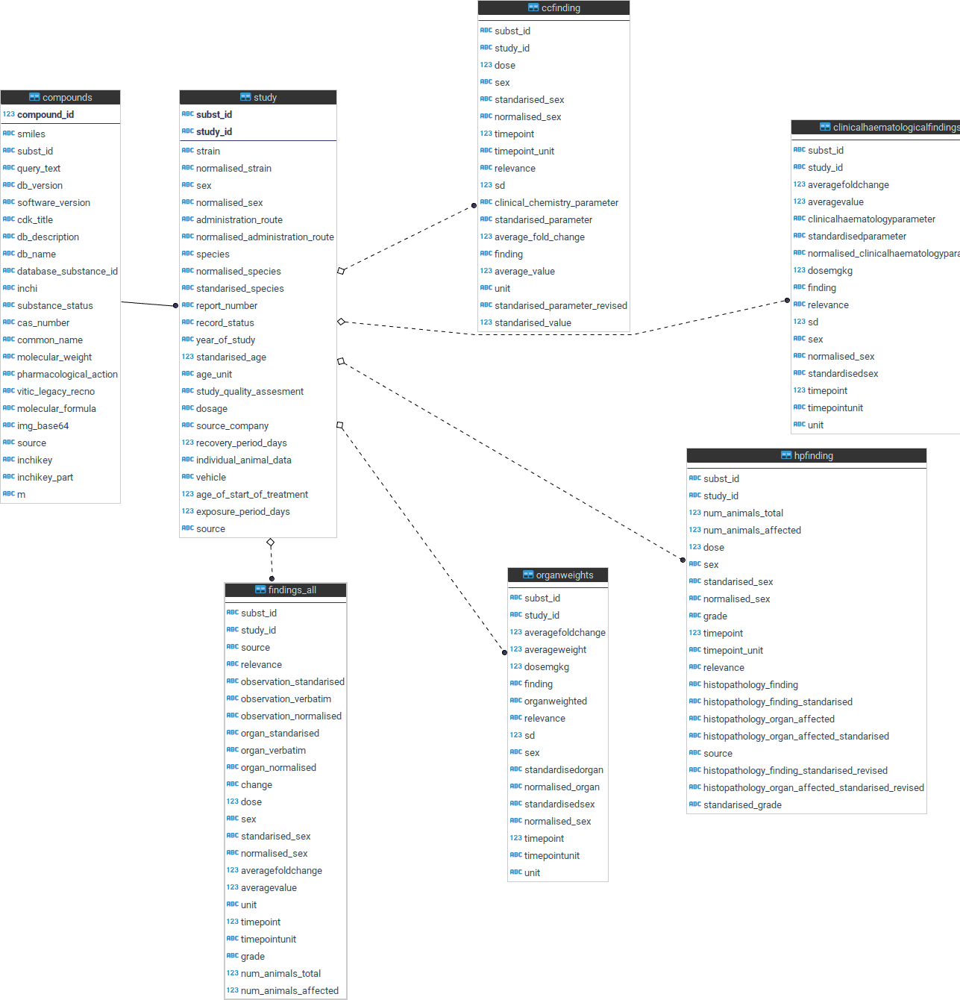

# Internal RDT

## Data model main entities

* compounds->studies->findings_all
    * Compounds: Structure etc
    * Studies: Experimental conditions: species, admin route, exposure period etc.
    * findings_all: Unified findings table. Stores different quantitative and qualitative findings in a unified way:
        * finding types: obatainde by "select distinct source from findings_all"
            * 'ClinicalChemicalFinding'
            * 'UrianalysisFinding'
            * 'HistopathologicalFinding'
            * 'ClinicalHaematologicalFinding'
            * 'OrganWeights'
        * Important note: findings_all only contains facts without inferences. To complete HPF findings inference must be applied. But other findings are didn't need inference.
    *

## Ontologies

* SQL inference:
    * Execute from pgadmin or psql the following query
	    * psql> select * from label_params('liver')
	    * A table with full recursive expansion is obtained
	    * psql> select * from label_params('necrosis')
		* A table with full recursive expansion
		
	* From scala console
	    * "liver" expansion
	    * scala> models.ontologies.Ontologies_DB.expandTerm("liver")
	    * res1: List[String] = List(hepatic duct intrahepatic part, liver middle lobe, liver, zone i, liver lobe, liver left medial lobe, liver perisinusoidal space, intralobular bile duct, intrahepatic part of right hepatic duct, liver sinusoid, liver lobule, liver left lateral lobe, liver parenchyma, liver quadrate lobe, liver bare area, portal triad, liver papillary process, bile duct intrahepatic part, interlobular bile duct, intrahepatic part of left hepatic duct, liver left lobe, liver right lobe, liver, zone ii, intrahepatic bile duct epithelium, liver, zone iii, liver, bile canaliculus, liver caudate lobe, liver acinus, portal lobule)

	    * "necrosis" expansion
	    * scala> models.ontologies.Ontologies_DB.expandTerm("necrosis")
	    * res3: List[String] = List(necrosis, hepatocellular, necrosis, squamous epithelium, necrosis, leydig cell, necrosis, respiratory epithelium, necrosis, zonal, diffus, necrosis, myocardiocytes, necrosis, testicular, necrosis, lymphocytes, necrosis, adnexal, necrosis, soft tissue, necrosis, zonal, single cell necrosis, necrosis, renal tubules, necrosis, olfactory epithelium, necrosis, myofiber, necrosis, zonal, periportal, necrosis, zonal, midzonal, necrosis, tubular, necrosis, endometrial, necrosis, focal/multifocal, necrosis, epidermal, necrosis, myometrial, necrosis, mucosa, necrosis, papillary, single cell necrosis, epithelial, cell debris, luminal, necrosis, fibrinoid, necrosis, testis, necrosis, neuronal, necrosis, zonal, centrilobular, fat necrosis, necrosis, necrosis, epithelial)

